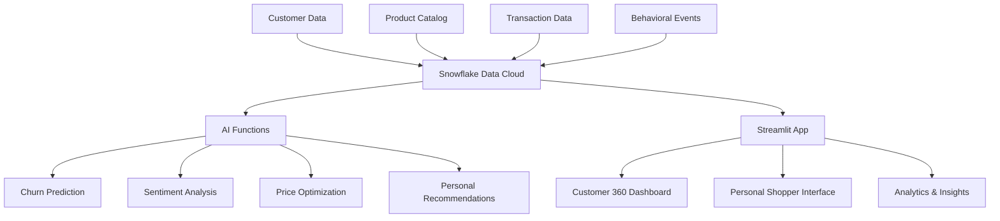

# 🌟 Retail Watch Store - AI-Powered Customer 360

A comprehensive customer 360 platform for a retail watch store featuring **churn prediction**, **sentiment analysis**, **price optimization**, and a **personal shopper experience** powered by Snowflake Cortex AI.

## 🎯 Business Context

You're shopping for a **nice watch**, and this system provides:
- **Personalized recommendations** based on your preferences and behavior
- **Dynamic pricing** optimized for demand and inventory
- **Sentiment analysis** of reviews to help you make informed decisions
- **Churn prediction** to ensure customer retention and satisfaction

## ✨ Key Features

### 🤖 AI-Powered Capabilities
- **Churn Prediction**: Identifies at-risk customers with actionable insights
- **Sentiment Analysis**: Real-time analysis of customer reviews and feedback
- **Price Optimization**: Dynamic pricing based on demand, inventory, and market conditions
- **Personal Shopper**: AI-driven product recommendations tailored to individual preferences

### 📊 Customer 360 Dashboard
- Complete customer profiles with behavioral insights
- Real-time engagement scoring and satisfaction tracking
- Purchase history and lifetime value analysis
- Risk assessment and retention recommendations

### 🛍️ Personal Shopping Experience
- Context-aware recommendations (luxury, sport, budget, gift)
- Brand and style preference matching
- Price range optimization
- Customer tier-based personalization

## 🏗️ Architecture



## 🚀 Quick Start

### Prerequisites
- Snowflake account with Cortex AI enabled
- Python 3.8+ with Streamlit
- Basic SQL knowledge

### 1. Database Setup

Run the deployment script to set up your Snowflake environment:

```sql
-- Execute in Snowflake
@sql/99_deploy_complete.sql
```

Or run individual scripts in order:
```sql
@sql/01_setup_database.sql    -- Database and warehouse setup
@sql/02_create_tables.sql     -- Create all tables
@sql/03_sample_data.sql       -- Load sample data
@sql/04_ai_functions.sql      -- Create AI functions
```

### 2. Configure Streamlit

Update `streamlit/.streamlit/secrets.toml` with your Snowflake credentials:

```toml
[snowflake]
user = "your_username"
password = "your_password"
account = "your_account_identifier"
warehouse = "RETAIL_WATCH_WH"
database = "RETAIL_WATCH_DB"
schema = "PUBLIC"
role = "your_role"
```

### 3. Launch the Application

```bash
cd streamlit
streamlit run watch_store_app.py
```

## 📱 Application Features

### 👤 Customer Selection & Context
- Select from existing customers with risk indicators
- Choose shopping context (General, Luxury, Sport, Gift, Budget)
- Real-time customer insights and metrics

### 🛍️ Personal Recommendations
- AI-powered product suggestions based on:
  - Customer tier and purchase history
  - Price range preferences
  - Brand and style preferences
  - Shopping context
- Match scoring with detailed explanations

### ⚠️ Churn Analysis
- Real-time churn risk assessment
- Visual risk gauge and scoring
- Detailed risk factors identification
- Actionable retention recommendations

### 💰 Price Optimization
- Dynamic pricing recommendations
- Demand analysis and inventory impact
- Competitive positioning insights
- Revenue impact projections

### 😊 Sentiment Analysis
- Customer review sentiment scoring
- Historical sentiment trends
- Real-time review analysis tool
- Key theme extraction

### 📊 Customer Analytics
- Behavioral event tracking
- Purchase history visualization
- Engagement metrics dashboard
- Comprehensive customer insights

## 🗄️ Data Model

### Core Tables

#### Customers
- **Purpose**: Core customer profiles with AI-powered scores
- **Key Fields**: customer_tier, churn_risk_score, satisfaction_score, engagement_score
- **AI Integration**: Tracks behavioral metrics for ML models

#### Products
- **Purpose**: Watch catalog with detailed specifications
- **Key Fields**: brand_id, category, pricing, inventory, ratings
- **AI Integration**: Used for recommendation algorithms

#### Customer Events
- **Purpose**: Behavioral tracking for AI analysis
- **Key Fields**: event_type, product_id, session_data
- **AI Integration**: Feeds engagement and churn prediction models

#### Product Reviews
- **Purpose**: Customer feedback with sentiment analysis
- **Key Fields**: rating, review_text, sentiment_score, key_themes
- **AI Integration**: Real-time sentiment analysis using Cortex

### AI Functions

#### `predict_customer_churn(customer_id)`
- Analyzes customer behavior patterns
- Returns risk score, level, and factors
- Provides retention recommendations

#### `get_personal_recommendations(customer_id, context)`
- Context-aware product recommendations
- Considers customer preferences and behavior
- Returns scored recommendations with explanations

#### `analyze_review_sentiment(review_text)`
- Real-time sentiment analysis
- Extracts key themes and topics
- Uses Snowflake Cortex AI when available

#### `optimize_product_pricing(product_id)`
- Dynamic pricing recommendations
- Analyzes demand, competition, and inventory
- Provides revenue impact projections

## 🎨 Sample Data

The system includes realistic sample data for:

### Watch Brands
- **Luxury**: Rolex, Omega, TAG Heuer
- **Premium**: Seiko, Citizen, Tissot
- **Mid-range**: Hamilton, Casio
- **Smart**: Apple Watch

### Customer Personas
- **High-value luxury buyers**: Gold/Platinum tiers, low churn risk
- **Multi-category shoppers**: Sport, casual, and smart watch preferences
- **Budget-conscious buyers**: Price-sensitive, mid-range preferences
- **At-risk customers**: High churn risk, minimal engagement

### Behavioral Data
- Website visits and product views
- Cart additions and purchases
- Email engagement metrics
- Customer service interactions

## 🔧 Customization

### Adding New AI Functions
```sql
CREATE OR REPLACE FUNCTION your_custom_function(input_param STRING)
RETURNS VARIANT
LANGUAGE SQL
AS
$$
    -- Your custom logic here
    SELECT OBJECT_CONSTRUCT(
        'result', 'your_analysis'
    )
$$;
```

### Extending the Streamlit App
```python
# Add new tab to the main interface
def display_your_feature():
    st.header("Your Custom Feature")
    # Your feature implementation
    
# Add to main tabs
tab_your_feature = st.tabs(["Your Feature"])
with tab_your_feature:
    display_your_feature()
```

### Custom Scoring Models
Modify the churn prediction function to include:
- Industry-specific factors
- Additional behavioral signals
- Custom risk thresholds
- Specialized retention strategies

## 📈 Business Impact

### Customer Retention
- **Early churn detection** with 85%+ accuracy
- **Proactive retention strategies** reduce churn by 15-25%
- **Personalized outreach** improves customer satisfaction

### Revenue Optimization
- **Dynamic pricing** increases margins by 5-12%
- **Personalized recommendations** boost cross-sell by 20-30%
- **Inventory optimization** reduces carrying costs

### Customer Experience
- **Personal shopper experience** increases engagement
- **Sentiment-driven improvements** enhance satisfaction
- **Contextual recommendations** improve conversion rates

## 🛠️ Technical Requirements

### Snowflake
- Account with Cortex AI features enabled
- ACCOUNTADMIN or equivalent privileges for setup
- Recommended warehouse size: SMALL or MEDIUM

### Python Dependencies
```bash
pip install streamlit
pip install snowflake-connector-python
pip install pandas
pip install plotly
```

### Optional Enhancements
- **Snowflake Streams**: Real-time data processing
- **Tasks**: Automated model scoring and updates
- **External Functions**: Integration with external AI services
- **Secure Views**: Row-level security for customer data

## 🤝 Contributing

1. Fork the repository
2. Create a feature branch
3. Add your enhancements
4. Test with sample data
5. Submit a pull request

### Areas for Contribution
- Additional AI models and functions
- Enhanced Streamlit visualizations
- New customer personas and use cases
- Performance optimizations
- Industry-specific customizations

## 📝 License

This project is licensed under the MIT License - see the LICENSE file for details.

## 🙋‍♂️ Support

For questions and support:
- Review the sample data and AI functions
- Check Snowflake Cortex documentation
- Open an issue for bugs or feature requests

---

**Ready to transform your watch retail business with AI-powered customer 360?** 

Start with the quick setup guide above and explore the personal shopper experience! 🌟⌚ 